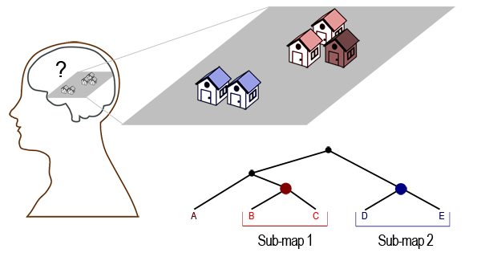

Browser-based experiment software for investigating human cognitive map structure
=============

Code for running psychological experiments in the browser, intended to investigate the structure of spatial memory. It has originally been written to facilitate a series of in-browser experiments by (Madl et al., submitted). It is made freely available here for academic (non-commercial) use. [Demo](http://madlnet.net/tsworks/experiment.html)

Citation
--------

If you use this code in academic work, please cite: 

Madl T., Franklin S., Chen K., Trappl R & Montaldi D., submitted. Exploring the structure of spatial representations. Cognition